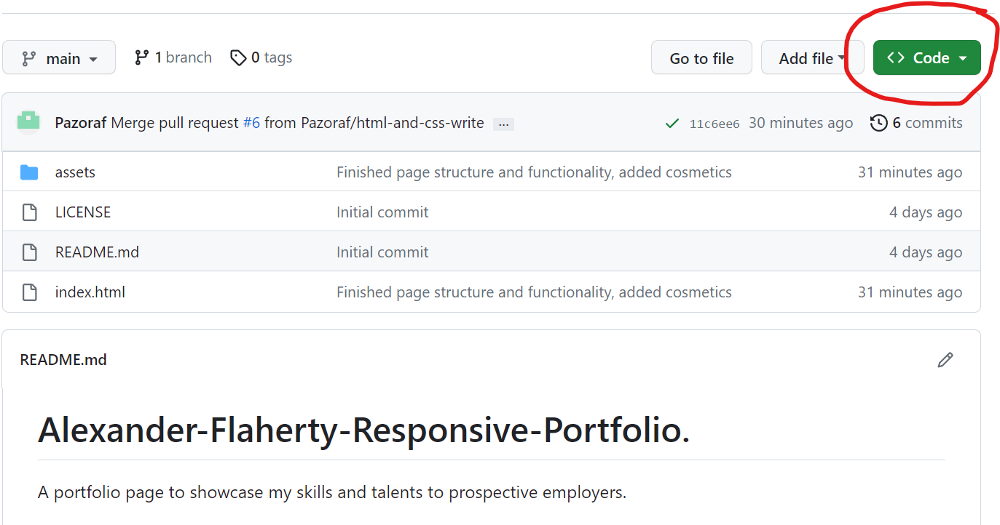
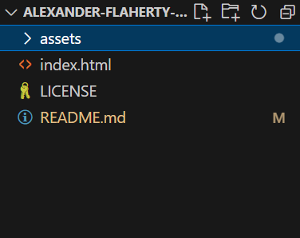
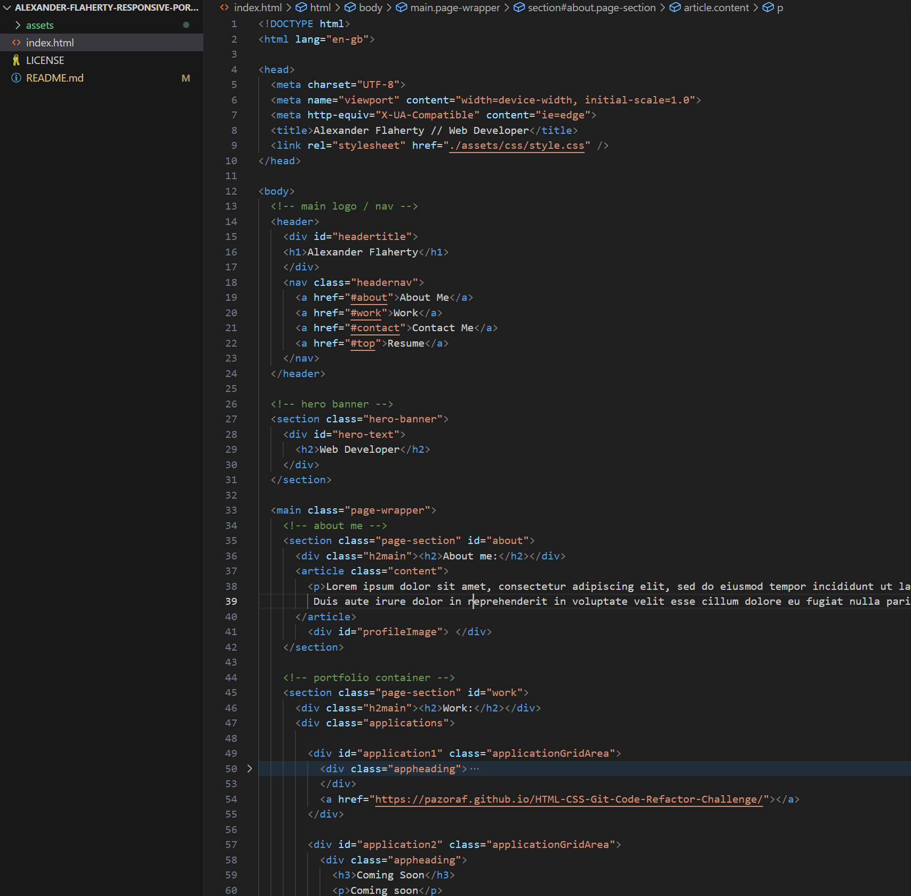
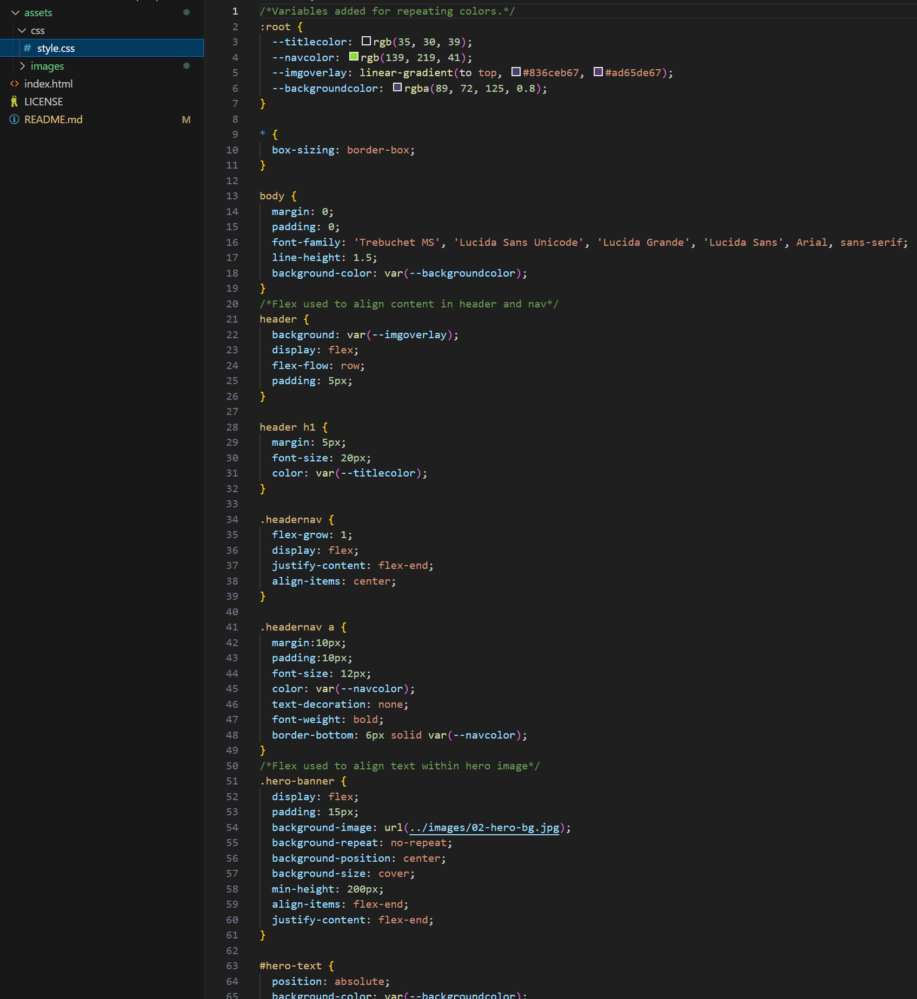
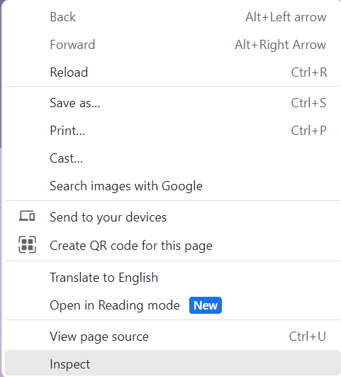
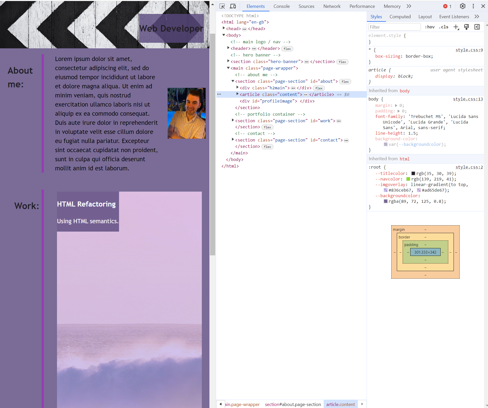

# Alexander Flaherty Responsive Portfolio

## Description
My intention with this project was to create a responsive website portfolio to demonstrate my skills for prospective employers. To do this I wanted to implement my knowledge of flexbox, media queries, CSS variables, and grid to create a webpage that is responsive to different screen sizes, and to also have a section that showcases my deployed web applications.

The site is deployed [here.](https://pazoraf.github.io/Alexander-Flaherty-Responsive-Portfolio/)

## Installation

1. Navigate to the code button on the GitHub repository.

2. Download the repository via your preferred means.

3. Open the repository in VSS or a similar editor.

## Usage

There are two methods to use the project.
### Usage Method 1
1. In VSS or a similar editor, open the repository as instructed in the installation steps.
2. Navigate to index.html to view the HTML code.

3. Navigate to style.css inside assets/css to view the CSS code.

### Usage Method 2
1. Open the deployed [website](https://pazoraf.github.io/Alexander-Flaherty-Responsive-Portfolio/) in Google Chrome.
2. Right-click anywhere on the page and select inspect.

3. Use the developer tools to inspect both the HTML and CSS.

## Credits

Resources:
- [W3Schools Flexbox](https://www.w3schools.com/css/css3_flexbox.asp)
- [W3Schools Grid](https://www.w3schools.com/css/css_grid.asp)
- [W3Schools Media Queries](https://www.w3schools.com/css/css_rwd_mediaqueries.asp)
- [W3Schools CSS Variables](https://www.w3schools.com/css/css3_variables.asp)
- [SheCodes Hover in CSS](https://www.shecodes.io/athena/5457-how-to-change-the-background-color-when-doing-hover-with-css)
- [Stackoverflow How to Overlay an Image With Color in CSS](https://stackoverflow.com/questions/18815157/how-to-overlay-image-with-color-in-css)
- [Markdown Syntax](https://www.markdownguide.org/basic-syntax/#links)

## License
Copyright (c) 2023 Alexander Flaherty.

Licensed under the [MIT](LICENSE) license.